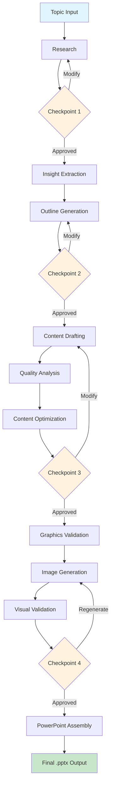
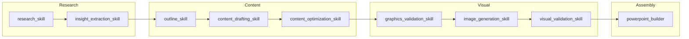

# Workflow Visualization

## Complete Workflow



## Skill Dependencies



## ASCII Workflow Diagram

```
┌────────────────────────────────────────────────────────────────────┐
│                    Presentation Generation Workflow                 │
├────────────────────────────────────────────────────────────────────┤
│                                                                     │
│   ┌─────────┐    ┌──────────┐    ┌──────────┐    ┌─────────────┐  │
│   │  Topic  │───▶│ Research │───▶│ Insights │───▶│   Outline   │  │
│   └─────────┘    └──────────┘    └──────────┘    └─────────────┘  │
│                       │                                │           │
│                       ▼                                ▼           │
│                  ☐ Checkpoint 1                   ☐ Checkpoint 2   │
│                                                                     │
│   ┌─────────┐    ┌──────────┐    ┌──────────┐    ┌─────────────┐  │
│   │  .pptx  │◀───│ Assembly │◀───│  Images  │◀───│   Content   │  │
│   └─────────┘    └──────────┘    └──────────┘    └─────────────┘  │
│                                       │                │           │
│                                       ▼                ▼           │
│                                  ☐ Checkpoint 4   ☐ Checkpoint 3   │
│                                                                     │
│   Legend:  ───▶ Flow    ☐ Human Checkpoint                         │
└────────────────────────────────────────────────────────────────────┘
```
