# Slide-Generator Plugin Enhancement Implementation Plan

**Project:** slide-generator  
**Plan Version:** 1.0  
**Created:** January 4, 2026  
**Target Completion:** 2-3 weeks (part-time)  
**Current Grade:** A- (8.8/10)  
**Target Grade:** A+ (9.5+/10)

-----

## Table of Contents

1. [Executive Overview](#executive-overview)
1. [Implementation Phases](#implementation-phases)
1. [Phase 1: Marketplace Integration](#phase-1-marketplace-integration)
1. [Phase 2: Claude Code Integration](#phase-2-claude-code-integration)
1. [Phase 3: Robustness Improvements](#phase-3-robustness-improvements)
1. [Phase 4: Polish & DX](#phase-4-polish--dx)
1. [Testing Strategy](#testing-strategy)
1. [Rollout Plan](#rollout-plan)
1. [Success Criteria](#success-criteria)

-----

# Executive Overview

## Goals

|Goal                   |Current State       |Target State                                          |
|-----------------------|--------------------|------------------------------------------------------|
|Marketplace installable|Manual clone/setup  |`/plugin marketplace add davistroy/slide-generator`   |
|Slash commands         |None                |`/slide-gen`, `/slide-research`, etc.                 |
|API resilience         |Basic error handling|Circuit breakers + retry with backoff                 |
|Health diagnostics     |None                |`health-check` command with full validation           |
|Developer experience   |Good                |Excellent (examples, visualization, consolidated libs)|

## Time Estimates

|Phase                           |Effort         |Priority|
|--------------------------------|---------------|--------|
|Phase 1: Marketplace Integration|4-6 hours      |Critical|
|Phase 2: Claude Code Integration|3-4 hours      |High    |
|Phase 3: Robustness Improvements|4-6 hours      |High    |
|Phase 4: Polish & DX            |3-4 hours      |Medium  |
|Testing & Validation            |2-3 hours      |Required|
|**Total**                       |**16-23 hours**|        |

## Dependencies to Add

```txt
# requirements.txt additions
circuitbreaker>=2.0.0,<3.0.0
tenacity>=8.2.0,<9.0.0
```

-----

# Implementation Phases

## Phase Dependency Graph

```
Phase 1 (Marketplace) ──┬──▶ Phase 2 (Claude Code)
                        │
                        └──▶ Phase 3 (Robustness) ──▶ Phase 4 (Polish)
```

Phase 1 is the foundation. Phases 2-4 can be done in parallel after Phase 1.

-----

# Phase 1: Marketplace Integration

**Priority:** Critical  
**Effort:** 4-6 hours  
**Outcome:** Plugin installable via `/plugin marketplace add`

## Task 1.1: Create Plugin Manifest Directory

### 1.1.1 Create Directory Structure

```bash
mkdir -p .claude-plugin
```

### 1.1.2 Create plugin.json

**File:** `.claude-plugin/plugin.json`

```json
{
  "schema_version": "1.0",
  "name": "slide-generator",
  "version": "2.0.0",
  "description": "AI-assisted presentation generation from research through final PowerPoint. Features autonomous research, content drafting, quality optimization, AI image generation, and brand-specific templates.",
  "author": {
    "name": "davistroy",
    "url": "https://github.com/davistroy"
  },
  "repository": {
    "type": "git",
    "url": "https://github.com/davistroy/slide-generator"
  },
  "license": "MIT",
  "keywords": [
    "presentation",
    "powerpoint",
    "pptx",
    "ai-generation",
    "research",
    "content-creation",
    "slides"
  ],
  "capabilities": {
    "skills": [
      {
        "name": "presentation-workflow",
        "description": "Full 11-step presentation generation workflow from topic to PowerPoint",
        "path": "plugin/skills/"
      },
      {
        "name": "research",
        "description": "Autonomous web research with Claude Agent SDK",
        "path": "plugin/skills/research_skill.py"
      },
      {
        "name": "content-generation",
        "description": "AI-powered content drafting and optimization",
        "path": "plugin/skills/content_drafting_skill.py"
      },
      {
        "name": "image-generation",
        "description": "Slide image generation via Gemini Pro",
        "path": "presentation-skill/lib/image_generator.py"
      },
      {
        "name": "powerpoint-assembly",
        "description": "Brand-specific PowerPoint building with python-pptx",
        "path": "presentation-skill/lib/assembler.py"
      }
    ],
    "commands": [
      {
        "name": "full-workflow",
        "description": "Run complete 11-step presentation generation",
        "usage": "python -m plugin.cli full-workflow \"Topic\" --template cfa"
      },
      {
        "name": "research",
        "description": "Conduct autonomous research on a topic",
        "usage": "python -m plugin.cli research \"Topic\" --output research.json"
      },
      {
        "name": "outline",
        "description": "Generate outline from research",
        "usage": "python -m plugin.cli outline research.json --output outline.md"
      },
      {
        "name": "draft-content",
        "description": "Draft presentation content from outline",
        "usage": "python -m plugin.cli draft-content outline.md --output content.md"
      },
      {
        "name": "optimize-content",
        "description": "Optimize content quality",
        "usage": "python -m plugin.cli optimize-content content.md --output optimized.md"
      },
      {
        "name": "generate-images",
        "description": "Generate slide images",
        "usage": "python -m plugin.cli generate-images content.md --resolution high"
      },
      {
        "name": "build-presentation",
        "description": "Build final PowerPoint file",
        "usage": "python -m plugin.cli build-presentation content.md --template cfa"
      },
      {
        "name": "health-check",
        "description": "Validate plugin configuration and dependencies",
        "usage": "python -m plugin.cli health-check"
      }
    ]
  },
  "requirements": {
    "python": {
      "minimum": "3.10",
      "recommended": "3.11"
    },
    "environment": {
      "ANTHROPIC_API_KEY": {
        "required": true,
        "description": "Claude API key from console.anthropic.com"
      },
      "GOOGLE_API_KEY": {
        "required": true,
        "description": "Gemini API key from aistudio.google.com"
      }
    },
    "dependencies": "requirements.txt"
  },
  "templates": [
    {
      "name": "cfa",
      "description": "Chick-fil-A branded template"
    },
    {
      "name": "stratfield",
      "description": "Stratfield Consulting branded template"
    }
  ],
  "documentation": {
    "readme": "README.md",
    "claude_instructions": "CLAUDE.md",
    "api_setup": "SETUP_APIS.md",
    "architecture": "API_ARCHITECTURE.md"
  }
}
```

### 1.1.3 Create Plugin README

**File:** `.claude-plugin/README.md`

```markdown
# Slide Generator Plugin

## Quick Install
```

/plugin marketplace add davistroy/slide-generator

```
## Setup

1. Set environment variables:
   ```bash
   export ANTHROPIC_API_KEY=your-key
   export GOOGLE_API_KEY=your-key
```

1. Install dependencies:
   
   ```bash
   pip install -r requirements.txt
   ```

## Usage

Generate a complete presentation:

```bash
python -m plugin.cli full-workflow "Your Topic" --template stratfield
```

Or run individual steps:

```bash
python -m plugin.cli research "Topic" --output research.json
python -m plugin.cli outline research.json --output outline.md
python -m plugin.cli draft-content outline.md --output content.md
python -m plugin.cli build-presentation content.md --template cfa
```

## Commands

|Command             |Description                  |
|--------------------|-----------------------------|
|`full-workflow`     |Complete 11-step generation  |
|`research`          |Autonomous topic research    |
|`outline`           |Generate presentation outline|
|`draft-content`     |Draft slide content          |
|`optimize-content`  |Quality optimization         |
|`generate-images`   |AI image generation          |
|`build-presentation`|Build PowerPoint file        |
|`health-check`      |Validate configuration       |

## Documentation

- [Full README](../README.md)
- [API Setup Guide](../SETUP_APIS.md)
- [Architecture](../API_ARCHITECTURE.md)

```
### 1.1.4 Validation Checklist

- [ ] `.claude-plugin/plugin.json` exists and is valid JSON
- [ ] All referenced paths in plugin.json exist
- [ ] Version matches README.md version
- [ ] All commands are implemented in CLI

---

## Task 1.2: Add Skill-Level SKILL.md Files

### 1.2.1 Create Skill Directory Structure

```bash
# Restructure skills with SKILL.md files
mkdir -p plugin/skills/research
mkdir -p plugin/skills/content
mkdir -p plugin/skills/images
mkdir -p plugin/skills/assembly
```

### 1.2.2 Research Skill SKILL.md

**File:** `plugin/skills/research/SKILL.md`

```markdown
---
name: slide-gen-research
description: "Autonomous web research for presentation topics using Claude Agent SDK. Conducts multi-step research, extracts insights, and manages citations."
version: "2.0.0"
author: "davistroy"
---

# Research Skill

Conducts comprehensive autonomous research on any topic using Claude Agent SDK with web search capabilities.

## Capabilities

- **Autonomous Research**: Multi-step web search and content extraction
- **Insight Extraction**: AI-powered analysis of research sources
- **Citation Management**: Automatic source tracking and formatting
- **Multi-Presentation Detection**: Identifies when topic should split into multiple presentations

## Usage

### Via CLI
```bash
python -m plugin.cli research "Rochester 2GC Carburetor Rebuild" --output research.json
```

### Via Python

```python
from plugin.skills.research_skill import ResearchSkill

skill = ResearchSkill(config)
result = skill.execute({
    "topic": "AI in Healthcare",
    "depth": "comprehensive",
    "max_sources": 20
})
```

## Input Parameters

|Parameter  |Type  |Required|Default   |Description                                         |
|-----------|------|--------|----------|----------------------------------------------------|
|topic      |string|Yes     |-         |Research topic                                      |
|depth      |string|No      |“standard”|Research depth: “quick”, “standard”, “comprehensive”|
|max_sources|int   |No      |10        |Maximum sources to gather                           |
|audience   |string|No      |“general” |Target audience for content                         |

## Output Format

```json
{
  "topic": "string",
  "sources": [
    {
      "url": "string",
      "title": "string",
      "content": "string",
      "relevance_score": 0.95
    }
  ],
  "insights": [
    {
      "key_point": "string",
      "supporting_evidence": ["string"],
      "citations": ["string"]
    }
  ],
  "suggested_presentations": [
    {
      "title": "string",
      "audience": "string",
      "focus": "string"
    }
  ]
}
```

## Dependencies

- Claude Agent SDK
- ANTHROPIC_API_KEY environment variable

## Examples

### Basic Research

```bash
python -m plugin.cli research "Machine Learning Basics"
```

### Comprehensive Research with Custom Output

```bash
python -m plugin.cli research "Quantum Computing Applications" \
  --depth comprehensive \
  --max-sources 25 \
  --output quantum-research.json
```

### Research for Specific Audience

```bash
python -m plugin.cli research "Cloud Architecture" \
  --audience "C-level executives" \
  --depth quick
```

```
### 1.2.3 Content Generation SKILL.md

**File:** `plugin/skills/content/SKILL.md`

```markdown
---
name: slide-gen-content
description: "AI-powered content drafting, quality analysis, and optimization for presentation slides. Generates titles, bullets, speaker notes, and graphics descriptions."
version: "2.0.0"
author: "davistroy"
---

# Content Generation Skill

Generates and optimizes presentation content using Claude API with quality analysis.

## Capabilities

- **Content Drafting**: Generate titles, bullets, speaker notes, graphics descriptions
- **Quality Analysis**: 5-dimension scoring (readability, tone, structure, redundancy, citations)
- **Content Optimization**: Automated improvement with before/after tracking
- **Graphics Validation**: Ensure descriptions are specific enough for image generation

## Usage

### Draft Content
```bash
python -m plugin.cli draft-content outline.md --output content.md
```

### Analyze Quality

```bash
python -m plugin.cli analyze-quality content.md
```

### Optimize Content

```bash
python -m plugin.cli optimize-content content.md --output optimized.md
```

## Quality Dimensions

|Dimension  |Weight|Description                              |
|-----------|------|-----------------------------------------|
|Readability|25%   |Flesch-Kincaid score, sentence complexity|
|Tone       |20%   |Consistency, audience appropriateness    |
|Structure  |20%   |Parallel construction, logical flow      |
|Redundancy |15%   |Duplicate content detection              |
|Citations  |20%   |Source attribution, evidence support     |

## Output Format

Content is output as Markdown with frontmatter:

```markdown
---
title: "Presentation Title"
author: "Generated"
date: "2026-01-04"
template: "stratfield"
quality_score: 8.5
---

# Slide 1: Introduction

## Title
Welcome to AI in Healthcare

## Bullets
- Point one with supporting detail
- Point two with evidence
- Point three with citation [1]

## Speaker Notes
Detailed notes for the presenter...

## Graphics Description
A modern hospital lobby with digital displays showing patient data dashboards...
```

```
### 1.2.4 Image Generation SKILL.md

**File:** `plugin/skills/images/SKILL.md`

```markdown
---
name: slide-gen-images
description: "AI image generation for presentation slides using Gemini Pro. Supports batch generation, style consistency, and visual validation."
version: "2.0.0"
author: "davistroy"
---

# Image Generation Skill

Generates slide images using Google Gemini Pro with style consistency.

## Capabilities

- **Batch Generation**: Generate all slide images in one run
- **Style Consistency**: Maintain visual coherence across slides
- **Resolution Options**: Low (fast), Medium (balanced), High (quality)
- **Visual Validation**: Optional AI-based quality check (experimental)

## Usage

```bash
python -m plugin.cli generate-images content.md --resolution high
```

## Input Requirements

Content file must include graphics descriptions in each slide:

```markdown
## Graphics Description
A professional business chart showing quarterly growth with blue and green color scheme...
```

## Resolution Options

|Resolution|Size     |Use Case              |Generation Time|
|----------|---------|----------------------|---------------|
|low       |512x512  |Draft/preview         |~5 sec/image   |
|medium    |1024x1024|Standard presentations|~10 sec/image  |
|high      |1536x1536|High-quality output   |~20 sec/image  |

## Dependencies

- Google Gemini Pro API
- GOOGLE_API_KEY environment variable
- Pillow for image processing

```
### 1.2.5 PowerPoint Assembly SKILL.md

**File:** `plugin/skills/assembly/SKILL.md`

```markdown
---
name: slide-gen-assembly
description: "Brand-specific PowerPoint building with python-pptx. Supports multiple templates, custom layouts, and programmatic slide generation."
version: "2.0.0"
author: "davistroy"
---

# PowerPoint Assembly Skill

Builds final PowerPoint presentations with brand-specific templates.

## Capabilities

- **Brand Templates**: CFA, Stratfield (extensible)
- **Multiple Content Types**: Text, bullets, tables, images, code blocks
- **Programmatic Control**: Full python-pptx integration
- **Cross-Platform**: Windows, macOS, Linux

## Usage

```bash
python -m plugin.cli build-presentation content.md --template stratfield
```

## Available Templates

|Template  |Description          |Use Case                  |
|----------|---------------------|--------------------------|
|cfa       |Chick-fil-A branding |CFA-specific presentations|
|stratfield|Stratfield Consulting|Client deliverables       |

## Adding Custom Templates

1. Create template file: `presentation-skill/templates/mytemplate.py`
1. Implement `MyTemplateBuilder` class extending `BaseTemplateBuilder`
1. Register in template registry

```python
from presentation_skill.templates.base import BaseTemplateBuilder

class MyTemplateBuilder(BaseTemplateBuilder):
    def __init__(self):
        super().__init__()
        self.primary_color = RGBColor(0x2E, 0x5E, 0xAA)
        self.font_family = "Arial"
    
    def build_title_slide(self, title, subtitle):
        # Implementation
        pass
```

## Output

Generates `.pptx` file compatible with:

- Microsoft PowerPoint 2016+
- Google Slides (import)
- LibreOffice Impress
- Apple Keynote (import)

```
### 1.2.6 Move Skill Files

```bash
# Move existing skill implementations to new structure
mv plugin/skills/research_skill.py plugin/skills/research/
mv plugin/skills/insight_extraction_skill.py plugin/skills/research/
mv plugin/skills/content_drafting_skill.py plugin/skills/content/
mv plugin/skills/content_optimization_skill.py plugin/skills/content/
mv plugin/skills/graphics_validation_skill.py plugin/skills/images/
# etc.
```

### 1.2.7 Update Imports

Update all imports in the codebase to reflect new structure:

```python
# Before
from plugin.skills.research_skill import ResearchSkill

# After
from plugin.skills.research.research_skill import ResearchSkill
```

-----

# Phase 2: Claude Code Integration

**Priority:** High  
**Effort:** 3-4 hours  
**Outcome:** Native slash commands and progress reporting

## Task 2.1: Add Slash Command Registration

### 2.1.1 Create Commands Directory

```bash
mkdir -p .claude/commands
```

### 2.1.2 Main Slide Generator Command

**File:** `.claude/commands/slide-gen.md`

```markdown
---
name: slide-gen
description: Generate a complete presentation on any topic
arguments:
  - name: topic
    description: The presentation topic
    required: true
  - name: template
    description: Template to use (cfa, stratfield)
    required: false
    default: stratfield
  - name: audience
    description: Target audience description
    required: false
---

# Slide Generator

Generate a complete presentation using the 11-step AI-assisted workflow.

## Usage
```

/slide-gen “Topic” [–template cfa|stratfield] [–audience “description”]

```
## Examples
```

/slide-gen “Rochester 2GC Carburetor Rebuild” –template cfa
/slide-gen “AI Transformation Strategy” –template stratfield –audience “C-level executives”
/slide-gen “Machine Learning Fundamentals” –audience “technical beginners”

```
## What This Does

1. **Research** - Autonomous web research with citations
2. **Insights** - Extract key findings and concepts
3. **Outline** - Generate presentation structure
4. **Content** - Draft titles, bullets, speaker notes
5. **Optimize** - Quality analysis and improvement
6. **Graphics** - Validate image descriptions
7. **Images** - Generate slide visuals (Gemini Pro)
8. **Validate** - Visual quality check (optional)
9. **Refine** - Iterative improvement
10. **Assemble** - Build PowerPoint file
11. **Output** - Final .pptx with brand styling

## Execution

Run:
```bash
python -m plugin.cli full-workflow "$TOPIC" --template $TEMPLATE --audience "$AUDIENCE"
```

## Checkpoints

The workflow pauses for approval at:

- After research (approve sources)
- After outline (approve structure)
- After content draft (approve content)
- After images (approve visuals)

## Output

Final output: `output/{topic}-presentation.pptx`

```
### 2.1.3 Research Command

**File:** `.claude/commands/slide-research.md`

```markdown
---
name: slide-research
description: Conduct autonomous research on a topic
arguments:
  - name: topic
    description: Research topic
    required: true
  - name: depth
    description: Research depth (quick, standard, comprehensive)
    required: false
    default: standard
---

# Slide Research

Conduct autonomous web research using Claude Agent SDK.

## Usage
```

/slide-research “Topic” [–depth quick|standard|comprehensive]

```
## Examples
```

/slide-research “Quantum Computing Applications”
/slide-research “Electric Vehicle Market Trends” –depth comprehensive

```
## Execution

```bash
python -m plugin.cli research "$TOPIC" --depth $DEPTH --output research.json
```

## Output

Creates `research.json` with:

- Source URLs and content
- Extracted insights
- Citation information
- Suggested presentation angles

```
### 2.1.4 Health Check Command

**File:** `.claude/commands/slide-health.md`

```markdown
---
name: slide-health
description: Check slide-generator plugin health and configuration
---

# Slide Generator Health Check

Validate that the slide-generator plugin is properly configured.

## Usage
```

/slide-health

```
## Execution

```bash
python -m plugin.cli health-check
```

## Checks Performed

- ✅ ANTHROPIC_API_KEY validity
- ✅ GOOGLE_API_KEY validity
- ✅ Python version compatibility
- ✅ Required dependencies installed
- ✅ Template availability
- ✅ Skill registry status

```
### 2.1.5 Quick Commands

**File:** `.claude/commands/slide-outline.md`

```markdown
---
name: slide-outline
description: Generate presentation outline from research
arguments:
  - name: input
    description: Research JSON file path
    required: true
---

# Generate Outline

## Execution

```bash
python -m plugin.cli outline "$INPUT" --output outline.md
```

```
**File:** `.claude/commands/slide-build.md`

```markdown
---
name: slide-build
description: Build PowerPoint from content file
arguments:
  - name: input
    description: Content markdown file
    required: true
  - name: template
    description: Template name
    required: false
    default: stratfield
---

# Build Presentation

## Execution

```bash
python -m plugin.cli build-presentation "$INPUT" --template $TEMPLATE
```

```
---

## Task 2.2: Add Progress Reporting

### 2.2.1 Create Progress Reporter Module

**File:** `plugin/lib/progress_reporter.py`

```python
"""
Progress reporting for Claude Code integration.
Outputs structured JSON that Claude can parse and present to users.
"""

import json
import sys
from datetime import datetime
from enum import Enum
from typing import Optional, Dict, Any


class ProgressStatus(Enum):
    STARTED = "started"
    IN_PROGRESS = "in_progress"
    CHECKPOINT = "checkpoint"
    COMPLETED = "completed"
    FAILED = "failed"
    SKIPPED = "skipped"


class ProgressReporter:
    """Reports workflow progress in structured format for Claude Code."""
    
    def __init__(self, workflow_name: str, total_steps: int):
        self.workflow_name = workflow_name
        self.total_steps = total_steps
        self.current_step = 0
        self.start_time = datetime.now()
    
    def _emit(self, data: Dict[str, Any]) -> None:
        """Emit progress data as JSON to stdout."""
        output = {
            "type": "slide_generator_progress",
            "timestamp": datetime.now().isoformat(),
            "workflow": self.workflow_name,
            **data
        }
        print(json.dumps(output), file=sys.stderr)
    
    def start_workflow(self) -> None:
        """Signal workflow start."""
        self._emit({
            "status": ProgressStatus.STARTED.value,
            "message": f"Starting {self.workflow_name}",
            "total_steps": self.total_steps
        })
    
    def start_step(self, step_name: str, step_number: int) -> None:
        """Signal step start."""
        self.current_step = step_number
        self._emit({
            "status": ProgressStatus.IN_PROGRESS.value,
            "step": step_number,
            "step_name": step_name,
            "total_steps": self.total_steps,
            "message": f"Step {step_number}/{self.total_steps}: {step_name}",
            "progress_percent": int((step_number - 1) / self.total_steps * 100)
        })
    
    def complete_step(self, step_name: str, step_number: int, 
                      artifacts: Optional[Dict[str, str]] = None) -> None:
        """Signal step completion."""
        self._emit({
            "status": ProgressStatus.COMPLETED.value,
            "step": step_number,
            "step_name": step_name,
            "message": f"Completed: {step_name}",
            "progress_percent": int(step_number / self.total_steps * 100),
            "artifacts": artifacts or {}
        })
    
    def checkpoint(self, step_name: str, step_number: int,
                   message: str, requires_approval: bool = True) -> None:
        """Signal checkpoint requiring user decision."""
        self._emit({
            "status": ProgressStatus.CHECKPOINT.value,
            "step": step_number,
            "step_name": step_name,
            "message": message,
            "requires_approval": requires_approval,
            "progress_percent": int(step_number / self.total_steps * 100)
        })
    
    def fail_step(self, step_name: str, step_number: int,
                  error: str, recoverable: bool = True) -> None:
        """Signal step failure."""
        self._emit({
            "status": ProgressStatus.FAILED.value,
            "step": step_number,
            "step_name": step_name,
            "error": error,
            "recoverable": recoverable,
            "message": f"Failed: {step_name} - {error}"
        })
    
    def complete_workflow(self, output_file: Optional[str] = None) -> None:
        """Signal workflow completion."""
        elapsed = (datetime.now() - self.start_time).total_seconds()
        self._emit({
            "status": ProgressStatus.COMPLETED.value,
            "message": f"Workflow completed in {elapsed:.1f}s",
            "progress_percent": 100,
            "elapsed_seconds": elapsed,
            "output_file": output_file
        })


# Convenience function for simple progress updates
def report_progress(step: int, total: int, message: str,
                    status: str = "in_progress") -> None:
    """Simple progress reporting function."""
    output = {
        "type": "slide_generator_progress",
        "timestamp": datetime.now().isoformat(),
        "status": status,
        "step": step,
        "total_steps": total,
        "message": message,
        "progress_percent": int(step / total * 100)
    }
    print(json.dumps(output), file=sys.stderr)
```

### 2.2.2 Integrate Progress Reporter into Workflow Orchestrator

**File:** `plugin/workflow_orchestrator.py` (modifications)

```python
# Add to imports
from plugin.lib.progress_reporter import ProgressReporter

class WorkflowOrchestrator:
    def __init__(self, registry, checkpoint_handler, config):
        self.registry = registry
        self.checkpoints = checkpoint_handler
        self.config = config
        self.progress = None  # Initialized per workflow
    
    def execute_workflow(self, workflow_name: str, steps: list, 
                        initial_input: dict) -> dict:
        """Execute workflow with progress reporting."""
        
        # Initialize progress reporter
        self.progress = ProgressReporter(workflow_name, len(steps))
        self.progress.start_workflow()
        
        current_output = initial_input
        
        for i, step in enumerate(steps, 1):
            step_name = step.get('name', f'Step {i}')
            skill_name = step.get('skill')
            
            try:
                # Report step start
                self.progress.start_step(step_name, i)
                
                # Get and execute skill
                skill = self.registry.get(skill_name)
                result = skill.execute(current_output)
                
                # Handle checkpoint if needed
                if step.get('checkpoint'):
                    self.progress.checkpoint(
                        step_name, i,
                        f"Review {step_name} output before continuing",
                        requires_approval=True
                    )
                    # Wait for checkpoint approval
                    self.checkpoints.wait_for_approval(step_name, result)
                
                # Report step completion
                self.progress.complete_step(
                    step_name, i,
                    artifacts=result.get('artifacts', {})
                )
                
                current_output = result
                
            except Exception as e:
                self.progress.fail_step(step_name, i, str(e))
                raise
        
        # Report workflow completion
        output_file = current_output.get('output_file')
        self.progress.complete_workflow(output_file)
        
        return current_output
```

-----

# Phase 3: Robustness Improvements

**Priority:** High  
**Effort:** 4-6 hours  
**Outcome:** Resilient API calls and comprehensive health checks

## Task 3.1: Add Circuit Breaker

### 3.1.1 Update Requirements

**File:** `requirements.txt` (add)

```txt
circuitbreaker>=2.0.0,<3.0.0
tenacity>=8.2.0,<9.0.0
```

### 3.1.2 Create Resilient API Client Wrapper

**File:** `plugin/lib/resilient_client.py`

```python
"""
Resilient API client wrappers with circuit breakers and retry logic.
"""

import logging
from functools import wraps
from typing import Callable, TypeVar, Any

from circuitbreaker import circuit, CircuitBreakerError
from tenacity import (
    retry,
    stop_after_attempt,
    wait_exponential,
    retry_if_exception_type,
    before_sleep_log
)

logger = logging.getLogger(__name__)

T = TypeVar('T')


# Circuit breaker configuration
CIRCUIT_FAILURE_THRESHOLD = 5
CIRCUIT_RECOVERY_TIMEOUT = 60
CIRCUIT_EXPECTED_EXCEPTIONS = (
    ConnectionError,
    TimeoutError,
    Exception  # Catch API errors
)

# Retry configuration
RETRY_MAX_ATTEMPTS = 3
RETRY_MIN_WAIT = 4
RETRY_MAX_WAIT = 60
RETRY_MULTIPLIER = 2


class APICircuitOpen(Exception):
    """Raised when circuit breaker is open."""
    pass


def resilient_api_call(
    failure_threshold: int = CIRCUIT_FAILURE_THRESHOLD,
    recovery_timeout: int = CIRCUIT_RECOVERY_TIMEOUT,
    max_retries: int = RETRY_MAX_ATTEMPTS
) -> Callable:
    """
    Decorator combining circuit breaker and retry logic.
    
    Usage:
        @resilient_api_call()
        def call_claude_api(prompt):
            return client.messages.create(...)
    """
    def decorator(func: Callable[..., T]) -> Callable[..., T]:
        # Apply circuit breaker
        @circuit(
            failure_threshold=failure_threshold,
            recovery_timeout=recovery_timeout,
            expected_exception=CIRCUIT_EXPECTED_EXCEPTIONS
        )
        # Apply retry logic
        @retry(
            stop=stop_after_attempt(max_retries),
            wait=wait_exponential(
                multiplier=RETRY_MULTIPLIER,
                min=RETRY_MIN_WAIT,
                max=RETRY_MAX_WAIT
            ),
            retry=retry_if_exception_type((ConnectionError, TimeoutError)),
            before_sleep=before_sleep_log(logger, logging.WARNING)
        )
        @wraps(func)
        def wrapper(*args, **kwargs) -> T:
            try:
                return func(*args, **kwargs)
            except CircuitBreakerError as e:
                logger.error(f"Circuit breaker open for {func.__name__}: {e}")
                raise APICircuitOpen(
                    f"Service temporarily unavailable. "
                    f"Circuit breaker will reset in {recovery_timeout}s"
                ) from e
        
        return wrapper
    return decorator


class ResilientClaudeClient:
    """Claude API client with circuit breaker and retry logic."""
    
    def __init__(self, client):
        self.client = client
    
    @resilient_api_call(failure_threshold=5, recovery_timeout=60)
    def create_message(self, **kwargs) -> Any:
        """Create a message with resilience."""
        return self.client.messages.create(**kwargs)
    
    @resilient_api_call(failure_threshold=3, recovery_timeout=30)
    def create_completion(self, **kwargs) -> Any:
        """Create a completion with resilience."""
        return self.client.completions.create(**kwargs)


class ResilientGeminiClient:
    """Gemini API client with circuit breaker and retry logic."""
    
    def __init__(self, client):
        self.client = client
    
    @resilient_api_call(failure_threshold=3, recovery_timeout=60)
    def generate_image(self, prompt: str, **kwargs) -> Any:
        """Generate image with resilience."""
        return self.client.generate(prompt, **kwargs)


# Standalone decorators for direct use
@resilient_api_call()
def call_with_resilience(func: Callable, *args, **kwargs) -> Any:
    """Call any function with resilience wrapper."""
    return func(*args, **kwargs)
```

### 3.1.3 Update Claude Client

**File:** `plugin/lib/claude_client.py` (modifications)

```python
from plugin.lib.resilient_client import ResilientClaudeClient

class ClaudeClient:
    def __init__(self, api_key: str):
        import anthropic
        self._raw_client = anthropic.Client(api_key=api_key)
        self._resilient = ResilientClaudeClient(self._raw_client)
    
    def generate(self, prompt: str, **kwargs) -> str:
        """Generate text with automatic retry and circuit breaker."""
        response = self._resilient.create_message(
            model=kwargs.get('model', 'claude-sonnet-4-5-20250514'),
            max_tokens=kwargs.get('max_tokens', 4096),
            messages=[{"role": "user", "content": prompt}]
        )
        return response.content[0].text
```

-----

## Task 3.2: Add Health Check Command

### 3.2.1 Create Health Check Module

**File:** `plugin/lib/health_check.py`

```python
"""
Health check module for slide-generator plugin.
Validates configuration, dependencies, and API connectivity.
"""

import os
import sys
import subprocess
import importlib
from dataclasses import dataclass
from enum import Enum
from typing import List, Optional, Tuple
import json


class HealthStatus(Enum):
    HEALTHY = "✅"
    WARNING = "⚠️"
    ERROR = "❌"
    UNKNOWN = "❓"


@dataclass
class HealthCheckResult:
    name: str
    status: HealthStatus
    message: str
    details: Optional[str] = None


class HealthChecker:
    """Comprehensive health checker for slide-generator plugin."""
    
    def __init__(self):
        self.results: List[HealthCheckResult] = []
    
    def check_all(self) -> Tuple[bool, List[HealthCheckResult]]:
        """Run all health checks and return overall status."""
        self.results = []
        
        # Run all checks
        self._check_python_version()
        self._check_anthropic_api_key()
        self._check_google_api_key()
        self._check_dependencies()
        self._check_templates()
        self._check_skill_registry()
        self._check_api_connectivity()
        
        # Determine overall health
        has_errors = any(r.status == HealthStatus.ERROR for r in self.results)
        
        return not has_errors, self.results
    
    def _check_python_version(self) -> None:
        """Check Python version compatibility."""
        version = sys.version_info
        version_str = f"{version.major}.{version.minor}.{version.micro}"
        
        if version >= (3, 11):
            status = HealthStatus.HEALTHY
            message = f"Python {version_str} (recommended)"
        elif version >= (3, 10):
            status = HealthStatus.HEALTHY
            message = f"Python {version_str} (supported)"
        else:
            status = HealthStatus.ERROR
            message = f"Python {version_str} (requires >=3.10)"
        
        self.results.append(HealthCheckResult(
            name="Python Version",
            status=status,
            message=message
        ))
    
    def _check_anthropic_api_key(self) -> None:
        """Check Anthropic API key configuration."""
        api_key = os.environ.get('ANTHROPIC_API_KEY', '')
        
        if not api_key:
            status = HealthStatus.ERROR
            message = "Not configured"
            details = "Set ANTHROPIC_API_KEY environment variable"
        elif api_key.startswith('sk-ant-'):
            status = HealthStatus.HEALTHY
            message = f"Configured ({api_key[:12]}...)"
            details = None
        else:
            status = HealthStatus.WARNING
            message = "Configured (unusual format)"
            details = "Key doesn't match expected sk-ant-* pattern"
        
        self.results.append(HealthCheckResult(
            name="ANTHROPIC_API_KEY",
            status=status,
            message=message,
            details=details
        ))
    
    def _check_google_api_key(self) -> None:
        """Check Google API key configuration."""
        api_key = os.environ.get('GOOGLE_API_KEY', '')
        
        if not api_key:
            status = HealthStatus.ERROR
            message = "Not configured"
            details = "Set GOOGLE_API_KEY environment variable"
        elif api_key.startswith('AIza'):
            status = HealthStatus.HEALTHY
            message = f"Configured ({api_key[:8]}...)"
            details = None
        else:
            status = HealthStatus.WARNING
            message = "Configured (unusual format)"
            details = "Key doesn't match expected AIza* pattern"
        
        self.results.append(HealthCheckResult(
            name="GOOGLE_API_KEY",
            status=status,
            message=message,
            details=details
        ))
    
    def _check_dependencies(self) -> None:
        """Check required Python packages."""
        required_packages = [
            'anthropic',
            'google.generativeai',
            'pptx',
            'PIL',
            'frontmatter',
            'textstat',
            'dotenv',
            'circuitbreaker',
            'tenacity'
        ]
        
        missing = []
        installed = []
        
        for package in required_packages:
            try:
                # Handle package name variations
                import_name = package.replace('-', '_')
                if import_name == 'PIL':
                    import_name = 'PIL'
                elif import_name == 'dotenv':
                    import_name = 'dotenv'
                elif import_name == 'google.generativeai':
                    import_name = 'google.generativeai'
                elif import_name == 'pptx':
                    import_name = 'pptx'
                
                importlib.import_module(import_name.split('.')[0])
                installed.append(package)
            except ImportError:
                missing.append(package)
        
        if not missing:
            status = HealthStatus.HEALTHY
            message = f"All {len(installed)} packages installed"
            details = None
        else:
            status = HealthStatus.ERROR
            message = f"{len(missing)} packages missing"
            details = f"Missing: {', '.join(missing)}"
        
        self.results.append(HealthCheckResult(
            name="Dependencies",
            status=status,
            message=message,
            details=details
        ))
    
    def _check_templates(self) -> None:
        """Check available presentation templates."""
        template_dir = "presentation-skill/templates"
        
        try:
            if os.path.isdir(template_dir):
                templates = [f.replace('.py', '') for f in os.listdir(template_dir) 
                           if f.endswith('.py') and not f.startswith('_')]
                
                if templates:
                    status = HealthStatus.HEALTHY
                    message = f"{len(templates)} templates available"
                    details = f"Templates: {', '.join(templates)}"
                else:
                    status = HealthStatus.WARNING
                    message = "No templates found"
                    details = None
            else:
                status = HealthStatus.ERROR
                message = "Template directory not found"
                details = f"Expected: {template_dir}"
        except Exception as e:
            status = HealthStatus.ERROR
            message = "Error checking templates"
            details = str(e)
        
        self.results.append(HealthCheckResult(
            name="Templates",
            status=status,
            message=message,
            details=details
        ))
    
    def _check_skill_registry(self) -> None:
        """Check skill registry status."""
        try:
            from plugin.skill_registry import SkillRegistry
            registry = SkillRegistry()
            skills = registry.list_all()
            
            if skills:
                status = HealthStatus.HEALTHY
                message = f"{len(skills)} skills registered"
                details = f"Skills: {', '.join(skills)}"
            else:
                status = HealthStatus.WARNING
                message = "No skills registered"
                details = None
        except Exception as e:
            status = HealthStatus.ERROR
            message = "Error loading registry"
            details = str(e)
        
        self.results.append(HealthCheckResult(
            name="Skill Registry",
            status=status,
            message=message,
            details=details
        ))
    
    def _check_api_connectivity(self) -> None:
        """Check API connectivity (lightweight test)."""
        # Only check if keys are configured
        anthropic_key = os.environ.get('ANTHROPIC_API_KEY')
        google_key = os.environ.get('GOOGLE_API_KEY')
        
        if not anthropic_key or not google_key:
            status = HealthStatus.WARNING
            message = "Skipped (keys not configured)"
            details = None
        else:
            # We don't make actual API calls to save costs
            # Just verify the client can be instantiated
            try:
                import anthropic
                client = anthropic.Client(api_key=anthropic_key)
                status = HealthStatus.HEALTHY
                message = "Clients initialized"
                details = "Full connectivity test skipped to save API costs"
            except Exception as e:
                status = HealthStatus.ERROR
                message = "Client initialization failed"
                details = str(e)
        
        self.results.append(HealthCheckResult(
            name="API Connectivity",
            status=status,
            message=message,
            details=details
        ))
    
    def print_report(self) -> None:
        """Print formatted health check report."""
        print("\n" + "=" * 60)
        print("       SLIDE-GENERATOR HEALTH CHECK")
        print("=" * 60 + "\n")
        
        for result in self.results:
            print(f"{result.status.value} {result.name}: {result.message}")
            if result.details:
                print(f"   └─ {result.details}")
        
        print("\n" + "-" * 60)
        
        errors = sum(1 for r in self.results if r.status == HealthStatus.ERROR)
        warnings = sum(1 for r in self.results if r.status == HealthStatus.WARNING)
        
        if errors == 0 and warnings == 0:
            print("✅ All checks passed. Plugin ready for use.")
        elif errors == 0:
            print(f"⚠️  {warnings} warning(s). Plugin functional with limitations.")
        else:
            print(f"❌ {errors} error(s), {warnings} warning(s). Fix errors before use.")
        
        print("=" * 60 + "\n")
    
    def to_json(self) -> str:
        """Return health check results as JSON."""
        return json.dumps({
            "results": [
                {
                    "name": r.name,
                    "status": r.status.name,
                    "message": r.message,
                    "details": r.details
                }
                for r in self.results
            ],
            "summary": {
                "total": len(self.results),
                "healthy": sum(1 for r in self.results if r.status == HealthStatus.HEALTHY),
                "warnings": sum(1 for r in self.results if r.status == HealthStatus.WARNING),
                "errors": sum(1 for r in self.results if r.status == HealthStatus.ERROR)
            }
        }, indent=2)


def run_health_check(output_json: bool = False) -> bool:
    """Run health check and return success status."""
    checker = HealthChecker()
    is_healthy, results = checker.check_all()
    
    if output_json:
        print(checker.to_json())
    else:
        checker.print_report()
    
    return is_healthy
```

### 3.2.2 Add CLI Command

**File:** `plugin/cli.py` (add command)

```python
import click
from plugin.lib.health_check import run_health_check

@cli.command()
@click.option('--json', 'output_json', is_flag=True, help='Output as JSON')
def health_check(output_json: bool):
    """Check plugin health and configuration."""
    is_healthy = run_health_check(output_json=output_json)
    sys.exit(0 if is_healthy else 1)
```

-----

# Phase 4: Polish & DX

**Priority:** Medium  
**Effort:** 3-4 hours  
**Outcome:** Improved developer experience

## Task 4.1: Consolidate Library Directories

### 4.1.1 Move Root lib/ Contents

```bash
# Move contents from root lib/ to plugin/lib/
mv lib/config_loader.py plugin/lib/
mv lib/gemini_client.py plugin/lib/
mv lib/image_prompt_builder.py plugin/lib/

# Remove empty root lib/
rmdir lib/
```

### 4.1.2 Update All Imports

Search and replace across codebase:

```python
# Before
from lib.config_loader import ConfigLoader
from lib.gemini_client import GeminiClient

# After
from plugin.lib.config_loader import ConfigLoader
from plugin.lib.gemini_client import GeminiClient
```

### 4.1.3 Update PYTHONPATH References

Update any documentation or scripts that reference the old structure.

-----

## Task 4.2: Add Workflow Visualization

### 4.2.1 Create Mermaid Diagram

**File:** `docs/workflow-diagram.md`

```markdown
# Workflow Visualization

## Complete Workflow

```mermaid
graph TD
    A[📝 Topic Input] --> B[🔍 Research]
    B --> C{Checkpoint 1}
    C -->|Approved| D[💡 Insight Extraction]
    C -->|Modify| B
    D --> E[📋 Outline Generation]
    E --> F{Checkpoint 2}
    F -->|Approved| G[✍️ Content Drafting]
    F -->|Modify| E
    G --> H[📊 Quality Analysis]
    H --> I[⚡ Content Optimization]
    I --> J{Checkpoint 3}
    J -->|Approved| K[🎨 Graphics Validation]
    J -->|Modify| G
    K --> L[🖼️ Image Generation]
    L --> M[👁️ Visual Validation]
    M --> N{Checkpoint 4}
    N -->|Approved| O[🔧 PowerPoint Assembly]
    N -->|Regenerate| L
    O --> P[📁 Final .pptx Output]
    
    style A fill:#e1f5fe
    style P fill:#c8e6c9
    style C fill:#fff3e0
    style F fill:#fff3e0
    style J fill:#fff3e0
    style N fill:#fff3e0
```



## Skill Dependencies


```
### 4.2.2 Add ASCII Diagram to README

**File:** `README.md` (add section)

```markdown
## Workflow Overview
```

┌────────────────────────────────────────────────────────────────────┐
│                    Presentation Generation Workflow                 │
├────────────────────────────────────────────────────────────────────┤
│                                                                     │
│   ┌─────────┐    ┌──────────┐    ┌──────────┐    ┌─────────────┐  │
│   │  Topic  │───▶│ Research │───▶│ Insights │───▶│   Outline   │  │
│   └─────────┘    └──────────┘    └──────────┘    └─────────────┘  │
│                       │                                │           │
│                       ▼                                ▼           │
│                  ☐ Checkpoint 1                   ☐ Checkpoint 2   │
│                                                                     │
│   ┌─────────┐    ┌──────────┐    ┌──────────┐    ┌─────────────┐  │
│   │  .pptx  │◀───│ Assembly │◀───│  Images  │◀───│   Content   │  │
│   └─────────┘    └──────────┘    └──────────┘    └─────────────┘  │
│                                       │                │           │
│                                       ▼                ▼           │
│                                  ☐ Checkpoint 4   ☐ Checkpoint 3   │
│                                                                     │
│   Legend:  ───▶ Flow    ☐ Human Checkpoint                         │
└────────────────────────────────────────────────────────────────────┘

```

```

-----

## Task 4.3: Add Example Outputs

### 4.3.1 Create Examples Directory

```bash
mkdir -p examples/sample-workflow
```

### 4.3.2 Create Sample Research Output

**File:** `examples/sample-workflow/1-research.json`

```json
{
  "topic": "Machine Learning Fundamentals",
  "research_depth": "standard",
  "timestamp": "2026-01-04T10:30:00Z",
  "sources": [
    {
      "url": "https://example.com/ml-intro",
      "title": "Introduction to Machine Learning",
      "content": "Machine learning is a subset of artificial intelligence...",
      "relevance_score": 0.95,
      "citation": "[1]"
    },
    {
      "url": "https://example.com/ml-algorithms",
      "title": "Common ML Algorithms Explained",
      "content": "The most common machine learning algorithms include...",
      "relevance_score": 0.88,
      "citation": "[2]"
    }
  ],
  "insights": [
    {
      "key_point": "ML is fundamentally about pattern recognition",
      "supporting_evidence": ["Statistical patterns", "Training data"],
      "citations": ["[1]", "[2]"]
    }
  ],
  "suggested_presentations": [
    {
      "title": "ML for Business Leaders",
      "audience": "executives",
      "focus": "business value and ROI"
    },
    {
      "title": "ML Technical Deep Dive",
      "audience": "engineers",
      "focus": "algorithms and implementation"
    }
  ]
}
```

### 4.3.3 Create Sample Outline

**File:** `examples/sample-workflow/2-outline.md`

```markdown
---
title: "Machine Learning Fundamentals"
audience: "Technical Beginners"
duration: 30
slides: 12
---

# Presentation Outline

## Section 1: Introduction (3 slides)
1. **Title Slide**: Machine Learning Fundamentals
2. **What is Machine Learning?**: Definition and context
3. **Why ML Matters**: Business and technical impact

## Section 2: Core Concepts (4 slides)
4. **Types of Learning**: Supervised, Unsupervised, Reinforcement
5. **The ML Pipeline**: Data → Model → Prediction
6. **Key Algorithms**: Overview of common approaches
7. **Training vs Inference**: Understanding the lifecycle

## Section 3: Practical Applications (3 slides)
8. **Real-World Examples**: Industry applications
9. **Getting Started**: First steps for beginners
10. **Tools & Frameworks**: Popular ML platforms

## Section 4: Conclusion (2 slides)
11. **Key Takeaways**: Summary of main points
12. **Next Steps**: Resources and learning path
```

### 4.3.4 Create Sample Content

**File:** `examples/sample-workflow/3-content.md`

```markdown
---
title: "Machine Learning Fundamentals"
template: "stratfield"
quality_score: 8.2
generated: "2026-01-04T11:00:00Z"
---

# Slide 1: Title

## Title
Machine Learning Fundamentals

## Subtitle
A Practical Introduction for Technical Beginners

## Speaker Notes
Welcome everyone. Today we'll explore machine learning from the ground up, focusing on practical understanding rather than mathematical complexity.

---

# Slide 2: What is Machine Learning?

## Title
What is Machine Learning?

## Bullets
- Algorithms that learn patterns from data
- Improves automatically through experience
- Makes predictions without explicit programming
- Foundation of modern AI applications

## Speaker Notes
Machine learning differs from traditional programming. Instead of writing explicit rules, we provide examples and let the algorithm discover patterns.

## Graphics Description
A split comparison showing traditional programming (rules + data = output) versus machine learning (data + output = rules), using clean iconographic style with blue and white color scheme.

---

# Slide 3: Why ML Matters

## Title
Why Machine Learning Matters

## Bullets
- Powers recommendations you see daily (Netflix, Amazon)
- Enables voice assistants and language translation
- Drives autonomous vehicle development
- Revolutionizes healthcare diagnostics

## Speaker Notes
Machine learning isn't just academic—it's integrated into products you use every day. Understanding ML helps you leverage these tools effectively.

## Graphics Description
A grid of 4 icons representing key ML applications: a play button for streaming, a microphone for voice assistants, a car for autonomous vehicles, and a heart for healthcare.
```

### 4.3.5 Create Example Index

**File:** `examples/README.md`

```markdown
# Example Workflow Outputs

This directory contains sample outputs from each stage of the presentation generation workflow.

## Sample Workflow: Machine Learning Fundamentals

| Step | File | Description |
|------|------|-------------|
| 1 | `sample-workflow/1-research.json` | Research output with sources and insights |
| 2 | `sample-workflow/2-outline.md` | Structured presentation outline |
| 3 | `sample-workflow/3-content.md` | Full slide content with speaker notes |
| 4 | `sample-workflow/4-optimized.md` | Quality-optimized content |
| 5 | `sample-workflow/5-final.pptx` | Final PowerPoint output |

## Using Examples

These examples can be used to:
- Understand expected input/output formats
- Test individual pipeline stages
- Debug workflow issues
- Train on the system before live use

## Running from Examples

```bash
# Start from existing research
python -m plugin.cli outline examples/sample-workflow/1-research.json

# Start from existing outline
python -m plugin.cli draft-content examples/sample-workflow/2-outline.md

# Build from existing content
python -m plugin.cli build-presentation examples/sample-workflow/3-content.md --template stratfield
```

```
---

# Testing Strategy

## Test Categories

### Unit Tests (Add/Extend)

```python
# tests/test_health_check.py
def test_health_check_with_valid_keys():
    """Test health check passes with valid configuration."""
    os.environ['ANTHROPIC_API_KEY'] = 'sk-ant-test'
    os.environ['GOOGLE_API_KEY'] = 'AIza-test'
    
    checker = HealthChecker()
    is_healthy, results = checker.check_all()
    
    assert is_healthy
    assert all(r.status != HealthStatus.ERROR for r in results)

def test_health_check_missing_keys():
    """Test health check reports missing keys."""
    os.environ.pop('ANTHROPIC_API_KEY', None)
    
    checker = HealthChecker()
    is_healthy, results = checker.check_all()
    
    assert not is_healthy
    key_result = next(r for r in results if r.name == 'ANTHROPIC_API_KEY')
    assert key_result.status == HealthStatus.ERROR
```

```python
# tests/test_resilient_client.py
def test_circuit_breaker_opens_after_failures():
    """Test circuit breaker opens after threshold failures."""
    # Mock client that always fails
    mock_client = Mock()
    mock_client.messages.create.side_effect = ConnectionError("Network error")
    
    resilient = ResilientClaudeClient(mock_client)
    
    # Should fail and eventually trip circuit breaker
    with pytest.raises(APICircuitOpen):
        for _ in range(10):
            try:
                resilient.create_message(model="test", messages=[])
            except:
                pass

def test_retry_with_backoff():
    """Test retry logic with exponential backoff."""
    call_count = 0
    
    @resilient_api_call(max_retries=3)
    def flaky_function():
        nonlocal call_count
        call_count += 1
        if call_count < 3:
            raise ConnectionError("Temporary failure")
        return "success"
    
    result = flaky_function()
    assert result == "success"
    assert call_count == 3
```

```python
# tests/test_progress_reporter.py
def test_progress_reporter_output_format():
    """Test progress reporter outputs valid JSON."""
    reporter = ProgressReporter("test-workflow", 5)
    
    # Capture stderr output
    captured = io.StringIO()
    with redirect_stderr(captured):
        reporter.start_step("Test Step", 1)
    
    output = captured.getvalue()
    data = json.loads(output)
    
    assert data['type'] == 'slide_generator_progress'
    assert data['step'] == 1
    assert data['status'] == 'in_progress'
```

### Integration Tests

```python
# tests/test_plugin_integration.py
def test_full_workflow_dry_run():
    """Test complete workflow with mocked APIs."""
    # Mock external APIs
    with patch('plugin.lib.claude_client.ClaudeClient') as mock_claude:
        with patch('plugin.lib.gemini_client.GeminiClient') as mock_gemini:
            mock_claude.return_value.generate.return_value = "Generated content"
            mock_gemini.return_value.generate_image.return_value = b"fake_image"
            
            result = runner.invoke(cli, [
                'full-workflow',
                'Test Topic',
                '--template', 'stratfield',
                '--dry-run'
            ])
            
            assert result.exit_code == 0
```

### CLI Tests

```python
# tests/test_cli.py
def test_health_check_command():
    """Test health-check CLI command."""
    result = runner.invoke(cli, ['health-check'])
    assert result.exit_code in [0, 1]  # 0 = healthy, 1 = unhealthy
    assert "SLIDE-GENERATOR HEALTH CHECK" in result.output

def test_health_check_json_output():
    """Test health-check with JSON output."""
    result = runner.invoke(cli, ['health-check', '--json'])
    data = json.loads(result.output)
    assert 'results' in data
    assert 'summary' in data
```

-----

# Rollout Plan

## Phase 1: Local Development (Day 1-2)

1. Create all new files without modifying existing functionality
1. Run existing tests to ensure no regressions
1. Add new unit tests for new modules
1. Test health-check command locally

## Phase 2: Integration (Day 3-4)

1. Integrate resilient client into existing Claude/Gemini clients
1. Integrate progress reporter into workflow orchestrator
1. Run integration tests
1. Update imports for consolidated lib directory

## Phase 3: Marketplace Prep (Day 5-6)

1. Add .claude-plugin/ manifest
1. Add slash command registrations
1. Create skill-level SKILL.md files
1. Test `/plugin install` flow locally

## Phase 4: Polish & Release (Day 7)

1. Add examples directory
1. Update README with new diagrams
1. Update CLAUDE.md with new commands
1. Tag release v2.1.0
1. Announce availability

-----

# Success Criteria

## Functional Criteria

|Criterion                |Validation                                                  |
|-------------------------|------------------------------------------------------------|
|Health check works       |`python -m plugin.cli health-check` returns valid status    |
|Circuit breaker works    |API failures trigger circuit after threshold                |
|Retry works              |Transient failures recovered with backoff                   |
|Progress reporting works |JSON progress events emitted during workflow                |
|Slash commands work      |`/slide-gen "Topic"` executes in Claude Code                |
|Marketplace install works|`/plugin marketplace add davistroy/slide-generator` succeeds|

## Quality Criteria

|Criterion     |Target                                  |
|--------------|----------------------------------------|
|Test coverage |>85% on new modules                     |
|No regressions|All existing tests pass                 |
|Documentation |All new features documented             |
|Examples      |Working examples for each workflow stage|

## Performance Criteria

|Criterion               |Target        |
|------------------------|--------------|
|Health check            |< 5 seconds   |
|Circuit breaker recovery|60 seconds    |
|Retry backoff           |Max 60 seconds|

-----

# File Checklist

## New Files to Create

- [ ] `.claude-plugin/plugin.json`
- [ ] `.claude-plugin/README.md`
- [ ] `.claude/commands/slide-gen.md`
- [ ] `.claude/commands/slide-research.md`
- [ ] `.claude/commands/slide-health.md`
- [ ] `.claude/commands/slide-outline.md`
- [ ] `.claude/commands/slide-build.md`
- [ ] `plugin/skills/research/SKILL.md`
- [ ] `plugin/skills/content/SKILL.md`
- [ ] `plugin/skills/images/SKILL.md`
- [ ] `plugin/skills/assembly/SKILL.md`
- [ ] `plugin/lib/resilient_client.py`
- [ ] `plugin/lib/health_check.py`
- [ ] `plugin/lib/progress_reporter.py`
- [ ] `docs/workflow-diagram.md`
- [ ] `examples/README.md`
- [ ] `examples/sample-workflow/1-research.json`
- [ ] `examples/sample-workflow/2-outline.md`
- [ ] `examples/sample-workflow/3-content.md`
- [ ] `tests/test_health_check.py`
- [ ] `tests/test_resilient_client.py`
- [ ] `tests/test_progress_reporter.py`
- [ ] `tests/test_cli.py`

## Files to Modify

- [ ] `requirements.txt` (add circuitbreaker, tenacity)
- [ ] `plugin/cli.py` (add health-check command)
- [ ] `plugin/workflow_orchestrator.py` (integrate progress reporter)
- [ ] `plugin/lib/claude_client.py` (use resilient wrapper)
- [ ] `README.md` (add workflow diagram, update docs)
- [ ] `CLAUDE.md` (add new commands)

## Files to Move/Delete

- [ ] Move `lib/config_loader.py` → `plugin/lib/`
- [ ] Move `lib/gemini_client.py` → `plugin/lib/`
- [ ] Move `lib/image_prompt_builder.py` → `plugin/lib/`
- [ ] Delete empty `lib/` directory

-----

*Implementation Plan v1.0 - January 4, 2026*